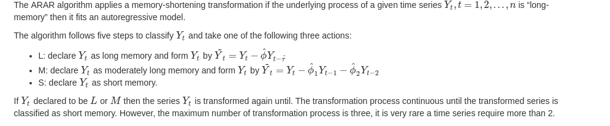
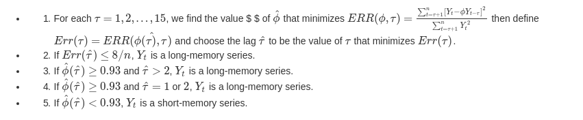
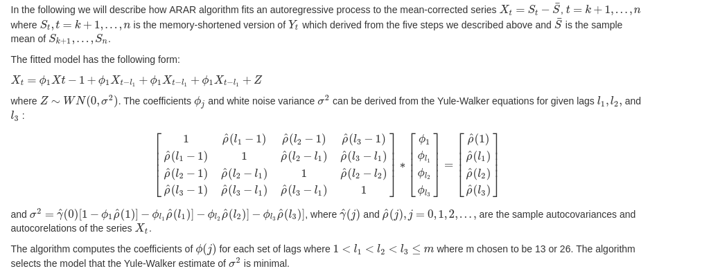
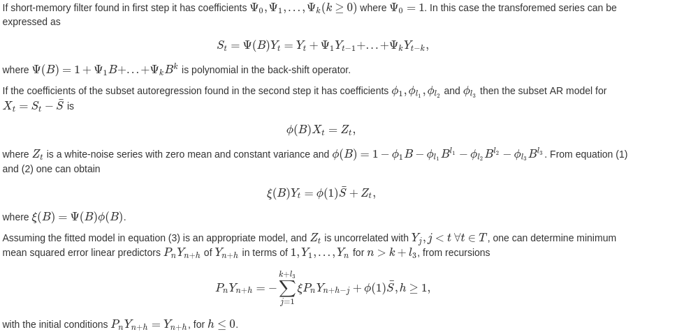

# arar: Time series forecasting via arar algorithm.

## The ARAR Algorithm:

## Memory Shortening

### The Algorithm:

### Subset Autoregressive Model:

### Forecasting

### References

author =  Brockwell, Peter J. and Davis, Richard A. ,
title = Introduction to time series and forecasting / Peter J. Brockwell and Richard A. Davis ,
isbn = 978-319-29852-8,
publisher = Springer New York ,
pages = xiii, 420 p. : ,
year = 2016 ,
type = Book ,
language = English ,
subjects = Time-series analysis. ,
life-dates =  2016
